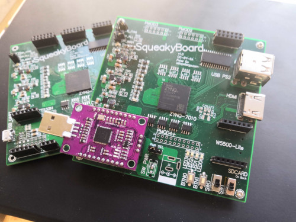
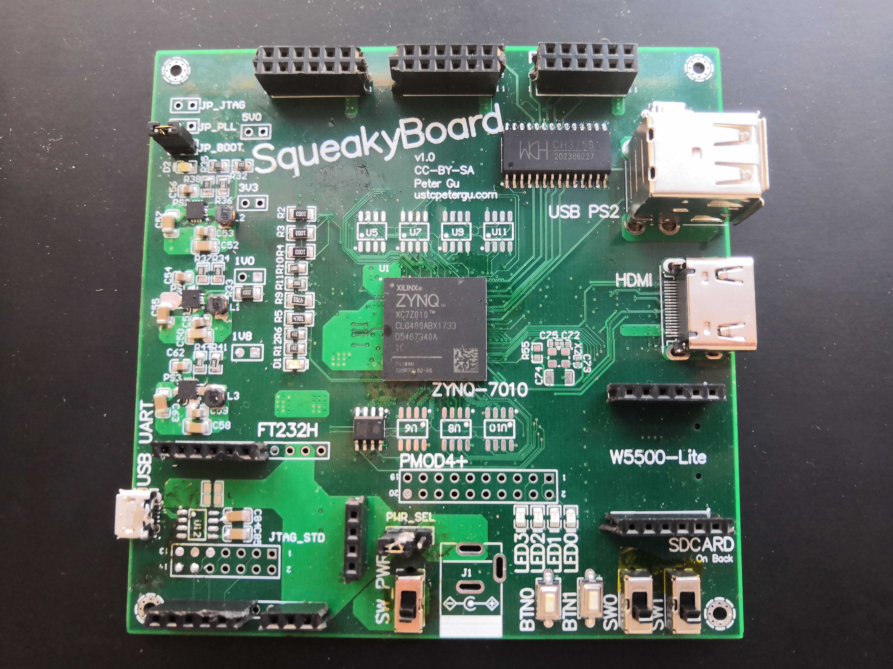
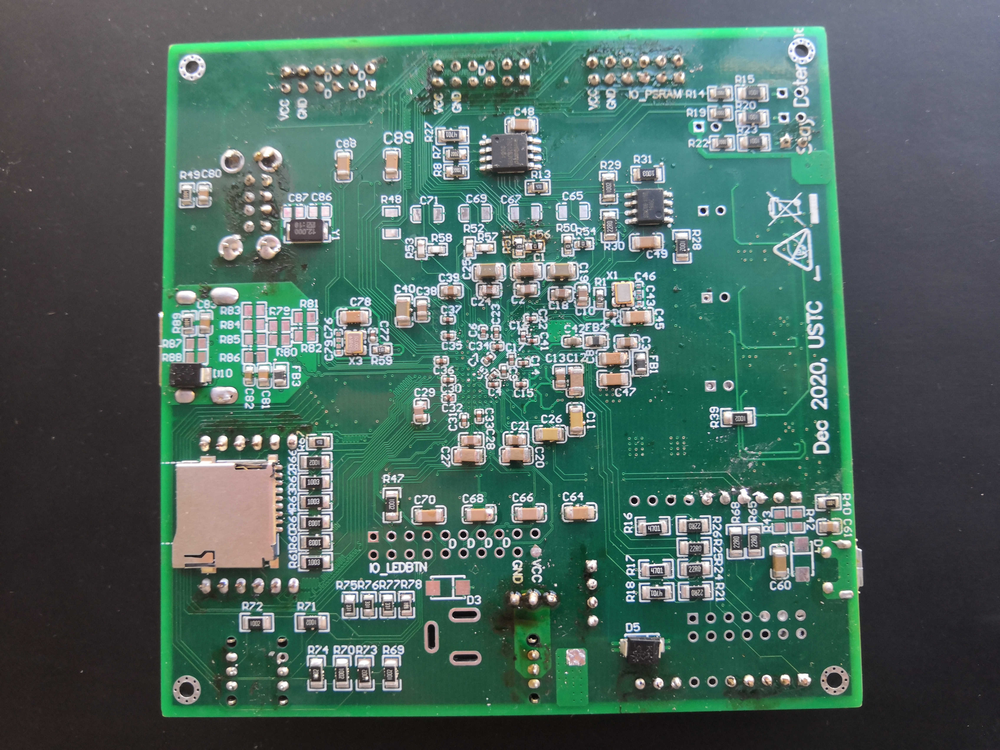
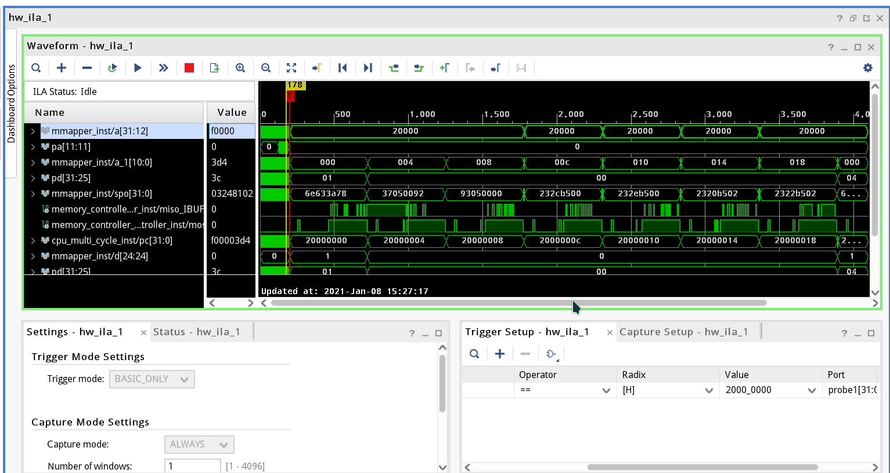

# SqueakyBoard

**A self-designed ZYNQ 7010 FPGA development board**

#### Main Features

- 4-layer, 9.9 cm x 9.9 cm, meets JLCPCB requirements, friendly for hand-soldering, cost-optimized
- 28 K logic elements & Vivado and Xilinx SDK compatible, using the programmable logic of ZYNQ 7010 CLG400

#### Connectivity

- Pluggable CJMCU-FT232HL as JTAG downloader, and standard 2x7 JTAG port
- SPI PSRAM up to 64 MBytes
- Basic HDMI
- ~~USB-to-UART~~
- Two USB ports, one connected directly and one via CH375b
- Micro SD Card
- Pluggable W5500-Lite module
- Up to 4 PMOD interface
- 4 LEDs, 2 slide switches, 2 push buttons
- Configuration via PS-side QSPI flash
- Power input via JTAG downloader, USB-to-UART, or 5V jack 

#### Testing

Untested parts: 

- W5500 module
- 5V jack input
- SD card only SPI is tested
- PSRAM only the first(U4), up to QPI mode 62.5MHz -- this is because laziness
- USB only PS2 keyboard tested
- Use 7020 instead of 7010 -- is power supply sufficient?

Parts need remedy: 

- Slide switch need VCC connection removed to avoid short -- it's more bad switch than bad design
- USB(direct connection) needs pullup constraint because logic level problem(FPGA 3.3V vs PS2 5V), but it do work for some (extremely cheap) keyboards
- The crystal on front side connected to a pin with warning, so is not used

Failed parts: 

- USB to UART -- D- and D+ on the chip was accidentally inverted

#### Design Files

Sorry but I use Altium Designer. altium/ contains design files, altium_pdf/ contains readable schematic(with comment of failed parts) and layout. 

#### Development Files

src/ contains example project source, bitstream, pre-generated SPI flash content, and xdc file. 

Be sure to follow the [noddr procedure](https://xilinx-wiki.atlassian.net/wiki/spaces/A/pages/18842377/Zynq-7000+AP+SoC+Boot+-+Booting+and+Running+Without+External+Memory+Tech+Tip) in Xilinx SDK

#### Warning

- Use as your own risk but feel free to ask me if any problem
- My testings are not sufficient
- No DDR or PS-side IO so the ARM cores are literally useless except booting from QSPI flash
- Using ingenuine JTAG downloader may have legal issue
- Electrostatic discharge should be taken care of -- it already has SMAJ5.0CA but who knows?
- Contains lead(Pb)
- It's a 4-layer so all common PCB design rules are put aside, signal integrity compromised 

#### Gallery

- Front view

- Back view

- ILA showing some assembly loaded from SD card running on RISC-V core in PSRAM

#### About the name

https://nethackwiki.com/wiki/Trap#Squeaky_board

#### Reference

- Mainly UG933, some UG483 and UG585
- Testing files from Digilent and fpga4fun

